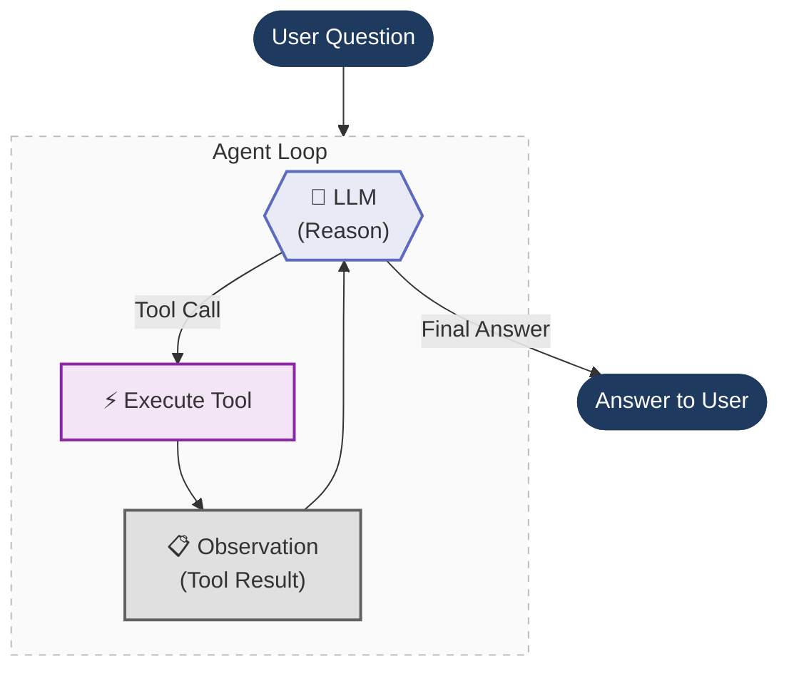

# Agents Under the Hood

**Peeling back the layers of a LangChain agent — from high-level abstractions down to raw prompt engineering.**

In this section we build the **same shopping assistant agent** three different ways. Each time we remove a layer of abstraction, so you can see exactly what's happening underneath.

## The Big Idea

Every AI agent — whether built with LangChain, LlamaIndex, CrewAI, or from scratch — follows the same core loop. We build it three times, each time peeling off a layer:

1. **Start with LangChain** — this is how you'd normally build an agent. `@tool`, `bind_tools()`, `init_chat_model()`. It just works. But what's actually happening underneath?
2. **Peel off LangChain** — build the same agent from scratch using only the Ollama SDK. Now you see what LangChain was doing for you: hand-written JSON schemas, manual message routing, raw tool dispatch.
3. **Peel off function calling** — go even deeper. Modern LLMs have built-in function calling, but that's a recent feature (June 2023). Before that, agents worked through pure prompt engineering: the **ReAct pattern**. We strip away function calling entirely and build it with just a prompt template and regex.

```
┌─────────────────────────────────────────────┐
│  File 1: LangChain                          │  ← @tool, bind_tools(), ToolMessage
│  ┌────────────────────────────────────────┐  │
│  │  File 2: Raw Function Calling          │  │  ← Hand-written JSON schemas, ollama.chat()
│  │  ┌─────────────────────────────────┐   │  │
│  │  │  File 3: Raw ReAct Prompt       │   │  │  ← Prompt template, regex, scratchpad
│  │  └─────────────────────────────────┘   │  │
│  └────────────────────────────────────────┘  │
└─────────────────────────────────────────────┘
```

Each file is self-contained and runnable on its own.

---

## The Agent Loop

At their core, all three implementations share the same loop — the agent reasons, picks a tool, executes it, observes the result, and repeats until it has a final answer:



What changes across the three files is **how** each step is implemented:

| Step | File 1 (LangChain) | File 2 (Raw Function Calling) | File 3 (Raw ReAct) |
|------|------|------|------|
| **Reason** | LLM returns structured `tool_calls` | LLM returns structured `tool_calls` | LLM outputs text: `Thought: ... Action: ...` |
| **Parse** | `ai_message.tool_calls[0]` | `message.tool_calls[0].function` | Regex: `r"Action:\s*(.+)"` |
| **Execute** | `tool.invoke(args)` | `tools[name](**args)` | `tools[name](*args)` |
| **Observe** | Append `ToolMessage` | Append `{"role": "tool"}` dict | Append to scratchpad string |
| **Finish** | No tool calls in response | No tool calls in response | `"Final Answer:"` found in text |

---

## Implementations

### 1. LangChain Tool Calling
**File:** [`1_agent_loop_langchain_tool_calling.py`](1_agent_loop_langchain_tool_calling.py)

We start here — this is how you'd normally build an agent. Reading through the code top to bottom:

- **Imports & config** — LangChain, LangSmith, model name
- **Tools** — two plain Python functions decorated with `@tool`. LangChain auto-generates the JSON schema from the function signature and docstring. No manual schema writing needed.
- **Agent loop** — initialize the LLM with `init_chat_model(f"ollama:{MODEL}")`, attach tools with `bind_tools()`, then loop: invoke the LLM, check if it returned tool calls, execute the tool, append a `ToolMessage`, repeat.

**What LangChain gives you:**
- `@tool` → auto-generates JSON tool schema from your function
- `init_chat_model()` → swap providers by changing one string (`"ollama:qwen3"` → `"openai:gpt-4o"`)
- `bind_tools()` → attaches tool definitions to the LLM
- `ToolMessage` → handles the tool result format
- Typed message objects (`SystemMessage`, `HumanMessage`) instead of raw dicts

It just works. But what's actually happening underneath all these abstractions?

**Stack:** `langchain`, `langsmith` for tracing

---

### 2. Raw Function Calling (No LangChain)
**File:** [`2_agent_loop_raw_function_calling.py`](2_agent_loop_raw_function_calling.py)

Now we peel off LangChain and build the exact same agent using only the `ollama` Python SDK. Compare with file 1 side-by-side to see what LangChain was doing for you. Reading top to bottom:

- **Imports & config** — just `ollama` and `langsmith`. No LangChain.
- **Tools** — the same two Python functions, but now they're just plain functions (no `@tool` decorator).
- **Tool registry** — a simple dict mapping tool names to functions. In file 1, LangChain built this for you with `{t.name: t for t in tools}`.
- **JSON tool schemas** — hand-written JSON dictionaries describing each tool's name, description, and parameters. This is what `@tool` auto-generated in file 1. You can see how verbose it is.
- **Agent loop** — call `ollama.chat()` directly, pass the JSON schemas as `tools=`, check `response.message.tool_calls`, dispatch with `tools[name](**args)`, append raw `{"role": "tool"}` dicts to the message history.

**What you see without LangChain:**
- Tool schemas are ~30 lines of JSON you have to write by hand
- Messages are plain dicts (`{"role": "system", "content": "..."}`) instead of typed objects
- Tool results are appended as `{"role": "tool", "content": result}` instead of `ToolMessage`
- Switching to a different provider (OpenAI, Anthropic) means rewriting the SDK calls, message format, and tool schema format

**Stack:** `ollama` SDK, `langsmith` for tracing

---

### 3. Raw ReAct Prompt (No Function Calling, No LangChain)
**File:** [`3_raw_react_prompt.py`](3_raw_react_prompt.py)

Now we peel off function calling itself. This is how agents worked **before LLMs had built-in tool calling** (pre-June 2023). No structured `tool_calls` in the API response — the LLM just outputs raw text, and we parse it with regex. Reading top to bottom:

- **Imports & config** — `ollama`, `re` (regex), `langsmith`. No LangChain, no function calling.
- **Tools** — same two Python functions, same tool registry dict.
- **ReAct prompt template** — this is the key. Instead of passing JSON tool schemas to the API, we describe the tools *inside the prompt itself* as plain text. The prompt also instructs the LLM to follow a strict format: `Thought → Action → Action Input → Observation`. This is the original **ReAct pattern** from the [Yao et al. 2022 paper](https://arxiv.org/abs/2210.03629).
- **Agent loop** — completely different from files 1 and 2:
  - Send the full prompt (template + accumulated scratchpad) as a single user message
  - Use `stop=["\nObservation"]` so the LLM stops before hallucinating the tool result — this lets us inject the real result
  - Parse the LLM's raw text output with regex to extract `Action:` and `Action Input:`
  - Execute the tool, then append the full cycle (`Thought/Action/Observation`) to the scratchpad string
  - Check for `"Final Answer:"` in the text to know when the agent is done

**What's different without function calling:**
- No JSON schemas — tools are described as plain text in the prompt
- No structured `tool_calls` — the LLM outputs text like `Action: get_product_price`
- No message history — instead, a **scratchpad** string accumulates the full reasoning chain
- Parsing is fragile — regex can break if the LLM doesn't follow the format exactly
- The `stop` parameter is critical — without it, the LLM would hallucinate tool results

**Stack:** `ollama` SDK, `re` (regex), `langsmith` for tracing

---

## The Same Agent, Three Ways

All three files answer the same question with the same tools:

> **"What is the price of a laptop after applying a gold discount?"**

**Tools:**
- `get_product_price(product)` — looks up prices from a catalog (laptop: $1,299.99)
- `apply_discount(price, discount_tier)` — applies a named discount tier (gold: 23% off)

**Expected flow:**
1. Agent calls `get_product_price("laptop")` → gets `1299.99`
2. Agent calls `apply_discount(1299.99, "gold")` → gets `1000.99`
3. Agent returns the final answer

The discount tiers use non-obvious percentages (bronze: 5%, silver: 12%, gold: 23%) so the LLM can't guess the result — it *must* use the tools.

---

## Quick Start

```bash
git checkout project/agents-under-the-hood
uv sync
```

Run each implementation:
```bash
uv run python 1_agent_loop_langchain_tool_calling.py
uv run python 2_agent_loop_raw_function_calling.py
uv run python 3_raw_react_prompt.py  # ReAct parsing is fragile; qwen3:1.7b is recommended here
```

## Prerequisites

- **Ollama** running locally with a model pulled (examples: `ollama pull qwen3:1.7b` or `ollama pull gpt-oss:20b`)
- **LangSmith API key** in `.env` (optional, for tracing)
